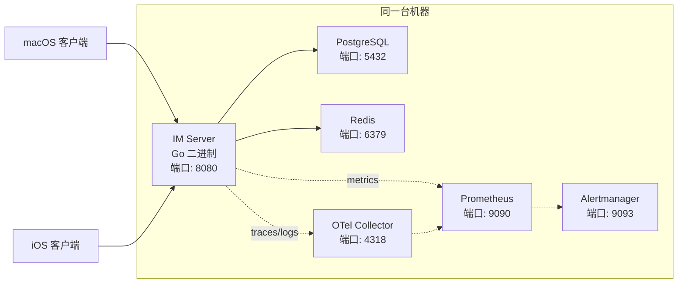
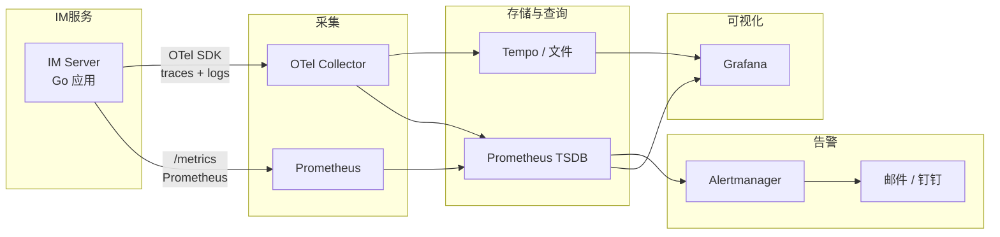

# IM 系统总体架构

## 分阶段发布计划

| 阶段 | 客户端 | 技术栈 | 说明 |
|------|--------|--------|------|
| **Phase 1** | macOS + iOS + Server | SwiftUI + Go | 桌面端 + iOS 先发，双端代码复用 |
| **Phase 2** | Android + Web | Kotlin + React | 覆盖剩余平台 |

---

## 系统架构图

```
┌─────────────────────────────────────────────────────────────┐
│                    客户端层 (Client)                         │
│  ┌──────────┐ ┌──────────┐ ┌──────────┐ ┌──────────┐      │
│  │ Phase 1  │ │ Phase 2  │ │ Phase 2  │ │ Phase 2  │      │
│  │ macOS    │ │ iOS      │ │ Android  │ │ Web      │      │
│  │ SwiftUI  │ │ SwiftUI  │ │ Kotlin   │ │ React    │      │
│  └──┬───────┘ └──┬───────┘ └──┬───────┘ └──┬───────┘      │
│     │            │            │            │               │
│  ┌──┴────────────┴────────────┴────────────┴───────────┐   │
│  │             共用网络层 (WebSocket Client)             │   │
│  │             序列化/反序列化 / 心跳 / 重连              │   │
│  └─────────────────────────────────────────────────────┘   │
└─────────────────────────────────────────────────────────────┘
      │
      ▼
┌─────────────────────────────────────────────────────────────┐
│                  网关层 (Gateway)                            │
│  ┌──────────────────────────────────────────────────────┐   │
│  │              WebSocket Connection Manager              │   │
│  │  连接保活 / 协议解析 / 心跳检测 / 流量控制               │   │
│  └──────────────────────────────────────────────────────┘   │
└─────────────────────────────────────────────────────────────┘
      │
      ▼
┌─────────────────────────────────────────────────────────────┐
│                     接入层 (Access)                          │
│  ┌──────────┐ ┌──────────┐ ┌──────────┐ ┌──────────┐      │
│  │ 用户认证  │ │ Session  │ │ 协议转换  │ │ 路由分发  │      │
│  │   (Auth) │ │ 管理     │ │ (Codec)  │ │ (Router) │      │
│  └──────────┘ └──────────┘ └──────────┘ └──────────┘      │
└─────────────────────────────────────────────────────────────┘
      │
      ▼
┌─────────────────────────────────────────────────────────────┐
│                      消息处理层 (Message)                     │
│  ┌──────────┐ ┌──────────┐ ┌──────────┐ ┌──────────┐      │
│  │ 消息接收  │ │ 消息验证  │ │ 消息路由  │ │ 消息持久化│      │
│  │ (Ingest) │ │(Validate)│ │ (Route)  │ │ (Store)  │      │
│  └──────────┘ └──────────┘ └──────────┘ └──────────┘      │
│  ┌──────────┐ ┌──────────┐ ┌──────────┐ ┌──────────┐      │
│  │ 离线消息  │ │ 消息推送  │ │ 已读回执  │ │ 消息搜索  │      │
│  │ (Offline)│ │ (Push)   │ │ (Receipt)│ │ (Search) │      │
│  └──────────┘ └──────────┘ └──────────┘ └──────────┘      │
└─────────────────────────────────────────────────────────────┘
      │
      ▼
┌─────────────────────────────────────────────────────────────┐
│                     业务逻辑层 (Business)                     │
│  ┌──────────┐ ┌──────────┐ ┌──────────┐ ┌──────────┐      │
│  │ 会话管理  │ │ 群组管理  │ │ 联系人   │ │ 文件管理  │      │
│  │(Convers.)│ │ (Group)  │ │(Contact) │ │ (File)   │      │
│  └──────────┘ └──────────┘ └──────────┘ └──────────┘      │
│  ┌──────────────────────────┐ ┌──────────────────────────┐│
│  │        系统通知          │ │                          ││
│  │       (Notify)          │ │                          ││
│  └──────────────────────────┘ └──────────────────────────┘│
└─────────────────────────────────────────────────────────────┘
      │
      ▼
┌─────────────────────────────────────────────────────────────┐
│                      存储层 (Storage)                        │
│  ┌──────────┐ ┌──────────┐ ┌──────────┐ ┌──────────┐      │
│  │ 消息存储  │ │ 用户存储  │ │ 关系存储  │ │ 文件存储  │      │
│  │ (消息DB)  │ │ (用户DB) │ │ (图/关系) │ │ (对象存储)│      │
│  └──────────┘ └──────────┘ └──────────┘ └──────────┘      │
│  ┌──────────┐ ┌──────────┐                                  │
│  │ 离线消息  │ │ 缓存     │                                  │
│  │ (MQ/队列) │ │(Redis)  │                                  │
│  └──────────┘ └──────────┘                                  │
└─────────────────────────────────────────────────────────────┘
```

## 功能需求矩阵

| 需求 | 支持 | 核心设计文件 |
|------|------|-------------|
| Human ↔ Human 会话 | ✅ | 03-message-routing.md |
| 多终端同时登录 | ✅ | 02-multi-terminal.md |
| 多终端同时收发 | ✅ | 02-multi-terminal.md |
| P2P 会话 | ✅ | 03-message-routing.md |
| 群聊 | ✅ | 03-message-routing.md |

## 技术栈

| 层级 | 技术选型 | 理由 |
|------|---------|------|
| **Server** | Go | 高性能、部署简单、IM 领域成熟 |
| **Database** | PostgreSQL + Redis | PG 强一致，Redis 高性能缓存/在线状态 |
| **macOS / iOS** | SwiftUI + WebSocket | 原生体验，共享 Network/Model/ViewModel |
| **Android** | Kotlin + WebSocket | Jetpack Compose 声明式 UI |
| **Web** | React + WebSocket | 通用性和生态成熟度最高 |
| **消息队列** | Redis Stream（初期）/ Kafka（后期） | 初期轻量，后期高吞吐 |
| **日志** | OpenTelemetry (OTel) | 统一日志 + 链路追踪，标准协议 |
| **监控** | Prometheus + Alertmanager | 指标采集 + 告警 |
| **告警通知** | 邮件 / 钉钉 / Slack | Alertmanager 支持多 Receiver |

### 代码复用策略

```
Phase 1: macOS + iOS (SwiftUI)
             │
             ├── IMCore Package
             │   ├── Network Layer
             │   ├── Models
             │   └── ViewModels
             │
Phase 2: Android (Kotlin) ── 按相同协议重新实现
         Web (React) ──────── 按相同协议重新实现
```

## 核心设计原则

1. **终端无关性** — 消息归属用户而非终端，多终端只是同一用户的不同入口
2. **写扩散 + 增量同步** — 消息存一份，每个终端独立维护同步进度
3. **模块化分层** — Gateway / Message / Business / Storage 各层职责清晰，可独立扩展

---

## Phase 1 部署方案

### 资源限制

Phase 1 只有 **1 台服务器**，所有服务部署在同一台机器上。



### 端口规划

| 服务 | 端口 | 说明 |
|------|------|------|
| IM Server (HTTP) | 8080 | REST API + WebSocket Upgrade |
| PostgreSQL | 5432 | 消息、用户、会话数据 |
| Redis | 6379 | 缓存、在线状态、离线消息 |
| IM Server (metrics) | 9091 | Prometheus 指标暴露 (/metrics) |
| OTel Collector | 4318 | OTLP HTTP 接收日志和链路 |
| Prometheus | 9090 | 指标存储和查询 |
| Alertmanager | 9093 | 告警管理和路由 |

### 对设计的影响

| 原设计中的项 | Phase 1 处理方式 |
|-------------|-----------------|
| Gateway 水平扩展 | 不需要，单进程处理所有连接 |
| 跨 Gateway 消息转发 | 不需要，ConnManager 全在内存 |
| 推送队列持久化 | 内存 channel 即可，进程内保活 |
| 消息搜索 | 不部署 ES，DB 全文索引替代 |
| 文件存储 | Phase 1 不支持 | 文件功能 Phase 2 |
| 消息类型 | 仅支持纯文本 (ContentType 0=Text, 5=System) | 图片/文件/音视频 Phase 2 |
| TLS | 不启用，明文 ws:// 和 http:// |
| 容器化 | 非必需，systemd 管理进程即可 |

### Phase 2 扩容方向

当需要第 2 台机器时：
- Gateway 分离出去单独部署
- 引入 HAProxy/Nginx 做 WebSocket 负载均衡
- 推送队列改为 Redis Stream
- 文件存储改为对象存储

---

## Observability 设计

### 数据流向



### 日志 (OpenTelemetry)

| 组件 | 角色 | Phase 1 方案 |
|------|------|-------------|
| OTel SDK | Go 应用内嵌入，自动采集日志和链路 | 标准库 otelgrpc/otelhttp 中间件 |
| OTel Collector | 接收、处理、导出遥测数据 | 同机部署，轻量配置 |
| 后端存储 | 链路和日志存储 | 初期写文件 + Prometheus，后期加 Tempo |

关键采集点：
- HTTP API 每次请求的耗时和状态码
- WebSocket 连接数变化
- 消息处理链路（收到 → 路由 → 推送 → 确认）
- 数据库查询耗时
- 推送队列积压

### 监控指标 (Prometheus)

**业务指标：**

| 指标 | 类型 | 说明 |
|------|------|------|
| im_connections_total | Gauge | 当前 WebSocket 连接数 |
| im_messages_sent_total | Counter | 消息发送总量 |
| im_messages_push_total | Counter | 消息推送总量 |
| im_messages_sync_total | Counter | 增量同步次数 |
| im_conversations_active | Gauge | 活跃会话数 |
| im_users_online | Gauge | 当前在线用户数 |

**性能指标：**

| 指标 | 类型 | 说明 |
|------|------|------|
| im_message_handle_duration_ms | Histogram | 消息处理耗时 (P50/P99) |
| im_push_queue_depth | Gauge | 推送队列深度 |
| im_db_query_duration_ms | Histogram | DB 查询耗时 |
| im_http_request_duration_ms | Histogram | HTTP 请求耗时 |
| im_ws_message_size_bytes | Histogram | WebSocket 消息大小分布 |

**系统指标：**
- Go 进程内存 / CPU / Goroutine 数
- PostgreSQL 连接数
- Redis 内存使用

### 告警规则

| 规则 | 条件 | 严重度 | 说明 |
|------|------|--------|------|
| 连接数异常 | 连接数突降 >50% | critical | 可能服务挂了 |
| 消息延迟高 | P99 处理耗时 >5s | warning | 需要排查 |
| 推送队列积压 | 队列深度 >1000 | warning | 消费能力不足 |
| DB 连接池耗尽 | 活跃连接数 >80% | critical | 数据库瓶颈 |
| Goroutine 泄漏 | goroutine 数 >10000 | warning | 代码问题 |
| 心跳超时 | 连续 5 分钟无心跳 | critical | 进程可能 hang |

---

## 安全设计

### Phase 1（无 TLS）

| 层面 | 方案 | 说明 |
|------|------|------|
| 密码存储 | RSA 非对称加密 | 公钥加密，私钥由服务端配置管理 |
| 传输 | 明文 ws:// + http:// | Phase 1 不启用 TLS |
| 接口认证 | JWT Bearer Token | 注册/登录返回，请求时带在 Header |
| Token 有效期 | 7 天，无刷新机制 | 简化实现 |
| WebSocket 鉴权 | 连接时携带 JWT Token | 服务端升级前校验 |

### Phase 2（补充安全加固）

- 启用 TLS（HTTPS + WSS）
- Token 刷新机制（短期 token + refresh token）
- RSA 密钥轮换
- 密钥与代码分离管理
