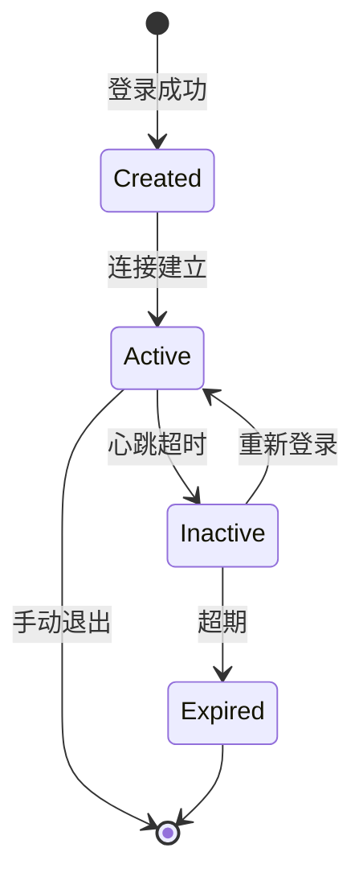

# 核心数据模型

## 1. 用户模型 (User)

| 字段 | 类型 | 说明 |
|------|------|------|
| ID | string | 全局唯一用户 ID |
| Type | enum | Human / Agent |
| Name | string | 显示名称 |
| Avatar | string | 头像 URL |
| Status | enum | Online / Offline / Busy |
| ExtMeta | map | 扩展属性 |
| CreatedAt | int64 | 创建时间 |

- Agent 与 Human 共用 User 模型，通过 `Type` 字段区分（Agent 仅为类型标记，无特殊运行时逻辑）
- `Online` 表示该用户至少有一个终端在线
- 密码使用 RSA 非对称加密存储，公钥加密、私钥由服务端配置管理

---

## 2. 终端 Session 模型 (Session)

| 字段 | 类型 | 说明 |
|------|------|------|
| SessionID | string | 全局唯一 session ID |
| UserID | string | 所属用户 ID |
| Device | enum | Phone / Desktop / Web |
| DeviceName | string | 设备名称 |
| ConnID | string | 当前 WebSocket 连接 ID |
| Status | enum | Active / Inactive / Expired |
| LoginAt | int64 | 登录时间 |
| LastActive | int64 | 最后活跃时间 |
| Metadata | map | 设备信息、IP、App 版本 |

### 核心设计

- 一个 User 对应多个 Session（多终端）
- 一个 Session 对应一个 WebSocket 长连接
- ConnID 用于 Gateway 层快速定位连接，存储在内存/Redis 中，不持久化到 DB
- 每个 Session 独立维护消息同步进度
- **SenderSessionID 由服务端从 WebSocket 连接绑定注入**，客户端 MsgSend 消息不携带此字段

### Session 生命周期



---

## 3. 消息模型 (Message)

| 字段 | 类型 | 说明 |
|------|------|------|
| MsgID | int64 | 全局唯一消息 ID (Snowflake) |
| ConvID | string | 所属会话 ID（P2P 如 `user_a:user_b`，群聊如 `group_gKx3mNpQ8`） |
| SenderID | string | 发送者 UserID |
| SenderSessionID | string | 发送者的 SessionID |
| ContentType | enum | Text / System / (Image/File/Recall/Edit 等 Phase 2) |
| Body | string | 消息体（文本或 JSON） |
| Mention | string[] | @提及的用户 ID 列表 |
| ReplyTo | int64 | 回复的消息 MsgID |
| ConvSeq | int64 | 会话内序号（从1递增，每个会话独立） |
| Timestamp | int64 | 服务端时间戳（毫秒） |
| ClientSeq | int64 | 客户端序列号（用于去重） |
| Status | enum | Sending / Sent / Delivered / Read |

### 关于消息序号

系统中有两个序号，职责不同：

| 序号 | 范围 | 用途 |
|------|------|------|
| MsgID (Snowflake) | 全局 | 唯一标识、全局排序、历史翻页 |
| ConvSeq | 会话内 | 每个会话从1开始递增，用于增量同步和未读数计算 |

### 消息的 ConvSeq 与同步模型

每个会话维护一个自增的 ConvSeq，每新增一条消息 +1。

同步由 `sync.req` 驱动，协议见 `05-protocol.md`。核心逻辑：

```
用户每加入一个会话，该会话会分配一个 user_seq（记录用户已看到的位置）。
  - user_seq 按 user+conv 维度存储（Redis: user:seq:{user_id}:{conv_id}）
  - 收到推送并 ack → user_seq 推进
  - sync.req 返回消息 → user_seq 推进到返回的 conv_seq
  - 未读数 = 该会话最新 conv_seq - user_seq
```

同一用户的不同 Session 各自维护自己的 `session:seq:{session_id}:{conv_id}`，用于独立同步进度。但未读数按 User 维度聚合（取所有 Session 中的最大值）。

### 消息 ID 生成 (Snowflake)

```
 1 bit  |   41 bits timestamp   | 10 bits worker | 12 bits sequence
--------|-----------------------|----------------|------------------
   0    | 毫秒时间戳(自定义纪元)  |   节点 ID      | 同一毫秒内序号
```

- 全局单调递增、趋势递增
- 单节点每秒约 409.6 万条消息
- Worker ID 通过配置文件或注册中心分配

### 客户端去重

- 每条消息带 `ClientSeq`（客户端本地自增，**每个 Session 独立序列，重启不清零，从本地持久化恢复**）
- 服务端按 `(SenderID, SessionID, ClientSeq)` 做唯一索引（不同 Session 的 client_seq 互不干扰）
- 重复消息返回已有 MsgID，不重复写入

---

## 4. 会话/房间模型 (Conversation)

| 字段 | 类型 | 说明 |
|------|------|------|
| ConvID | string | 全局唯一会话 ID（见下方生成规则） |
| Type | enum | P2P / Group（客户端通过此字段区分渲染方式） |
| Name | string | 群聊=群名，P2P=自动生成 |
| OwnerID | string | 创建者（群主） |
| Avatar | string | 会话头像 |
| CreatedAt | int64 | 创建时间 |

### 会话成员

| 字段 | 类型 | 说明 |
|------|------|------|
| ConvID | string | 会话 ID |
| UserID | string | 用户 ID |
| Role | enum | Member / Admin / Owner |
| Nickname | string | 群内昵称 |
| Mute | bool | 是否免打扰 |
| JoinedAt | int64 | 加入时间 |

### P2P ConvID 生成规则

两个用户 ID 按字典序排序后以 `:` 拼接，保证确定性和去重。会话的 `type=P2P`。

```
例：user_a 和 user_b → "user_a:user_b"
例：alice 和 bob     → "alice:bob"
```

### 群聊 ConvID 生成规则

服务端创建群时生成随机短 ID，会话的 `type=Group`。

```
例：group_gKx3mNpQ8
```

> ConvID 不编码类型信息，类型通过 Conversation 的 `type` 字段区分。服务端收到消息时根据 ConvID 查库获取类型。

---

## 5. 回执模型 (Receipt)

| 字段 | 类型 | 说明 |
|------|------|------|
| MsgID | int64 | 消息 ID |
| UserID | string | 接收者用户 ID |
| SessionID | string | 接收者终端 SessionID |
| Status | enum | Delivered / Read |
| Timestamp | int64 | 回执时间 |

### 回执策略

- **送达回执**：服务端推送消息后自动写入
- **已读回执**：用户阅读消息后客户端通过 HTTP 上报
- 每个 Session 独立记录
- 查询时按 UserID 聚合：任一 Session 已读 → 标记用户已读
