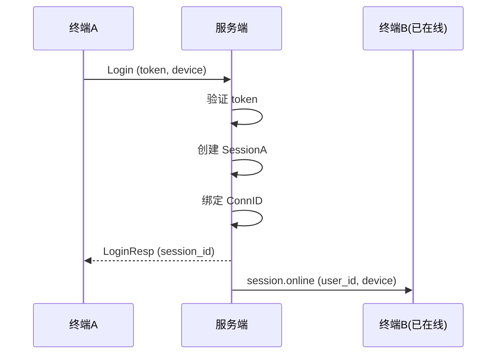
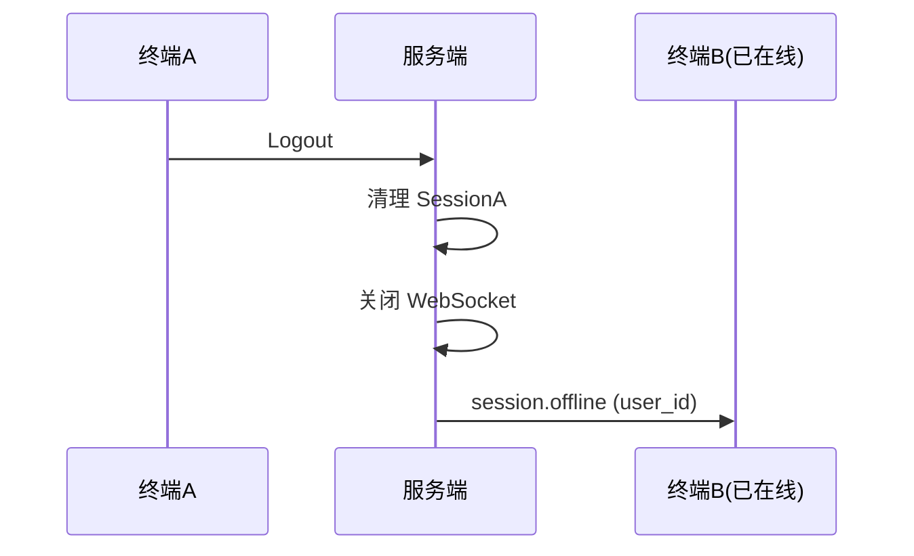
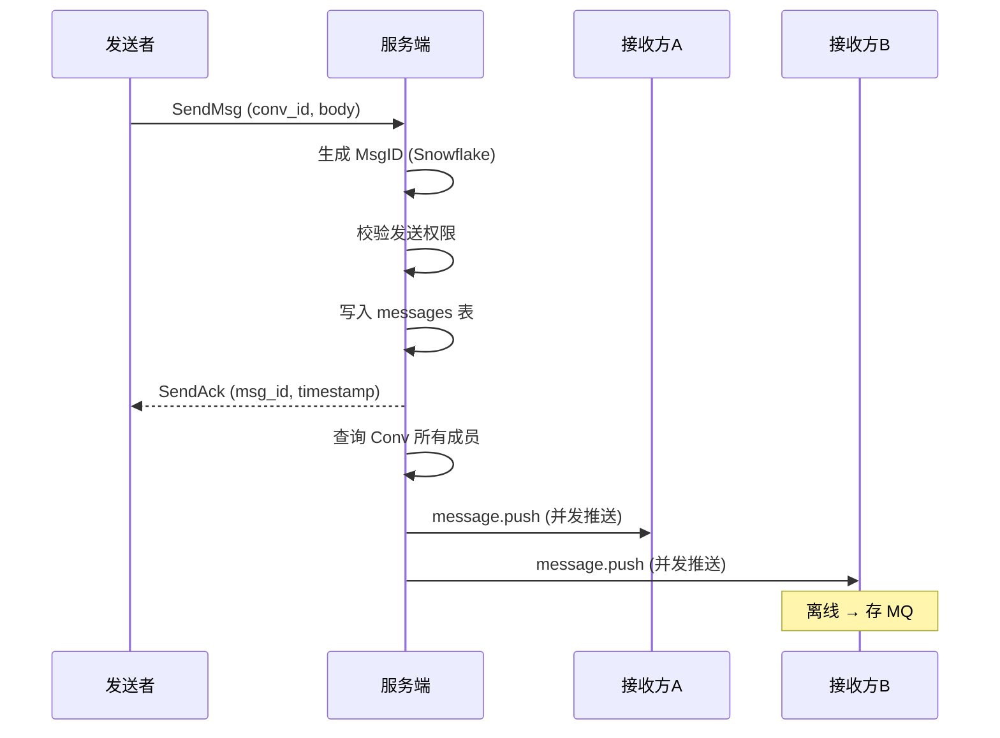
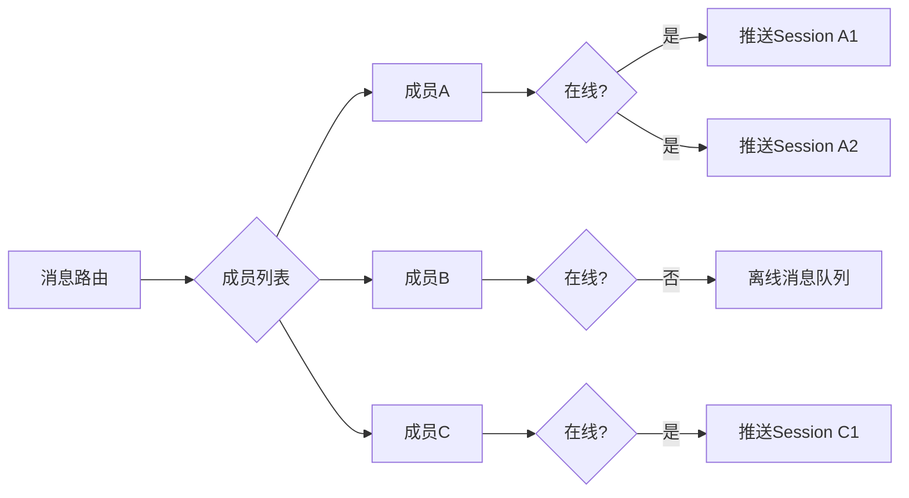
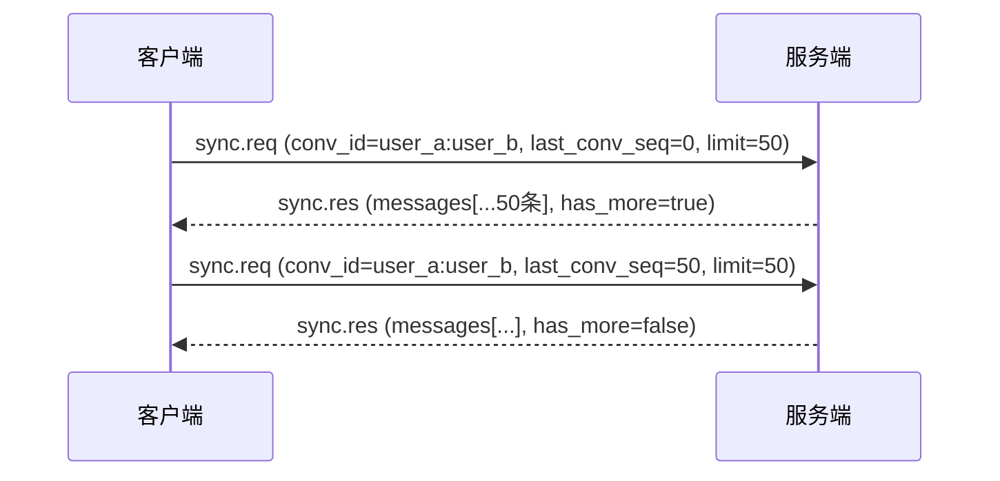
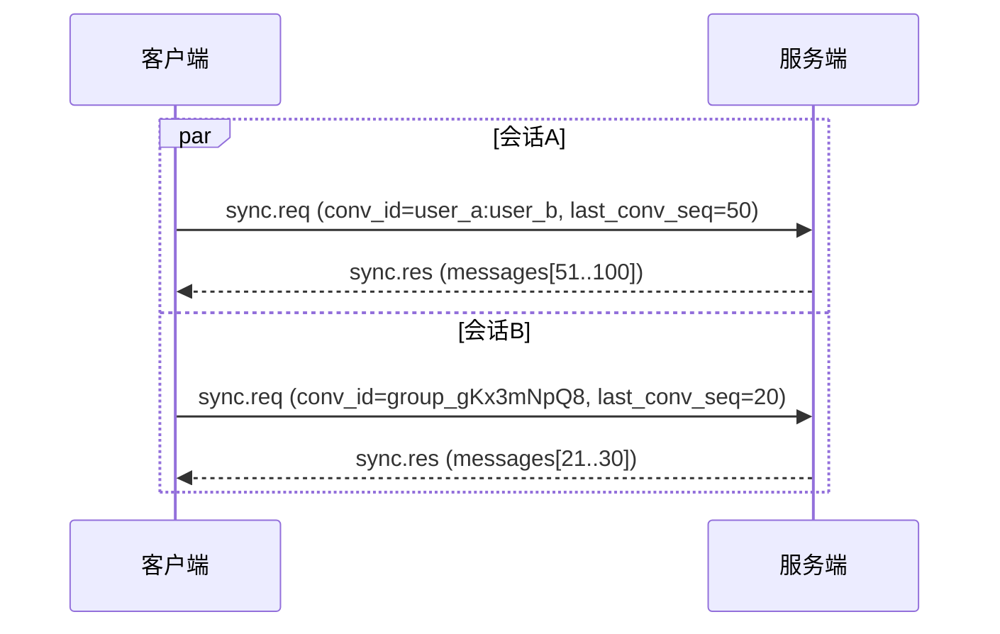
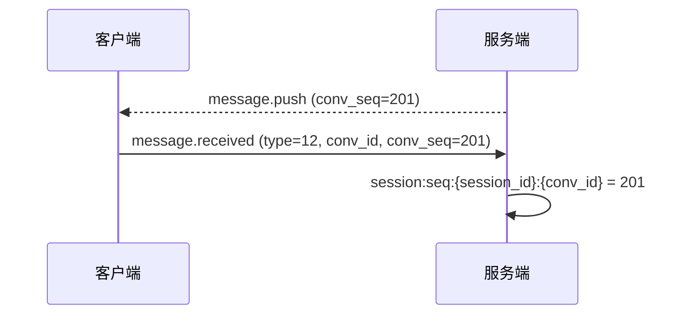
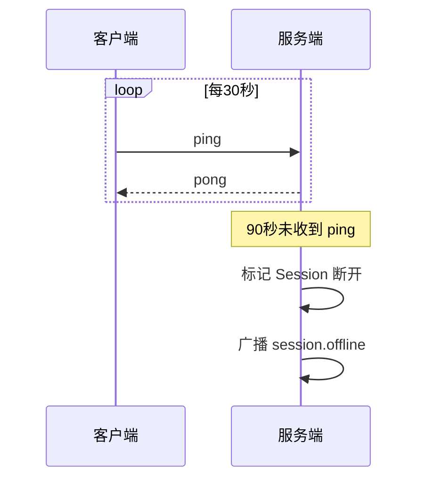

# 多终端同时登陆与消息同步

## 1. 多终端设计

核心思想：**每个终端独立持有 Session，按 User 维度聚合。**

```
User "张三"
  ├── Session A: iPhone 15
  ├── Session B: MacBook Pro
  └── Session C: Chrome 网页
```

### 登录流程



### 登出流程



### 互踢策略

| 模式 | 行为 | 适用场景 |
|------|------|---------|
| 共存（默认） | N 个终端共存 | 通用 IM |
| 互踢 | 新终端挤掉旧终端 | 安全敏感应用 |

---

## 2. 消息发送与多终端扇出

### 发消息流程



### 扇出逻辑



---

## 3. 增量消息同步

每个 Session 独立维护 `last_seq`，标记已接收的最新序号。

### 首次登录（拉取历史消息）

首次进入会话时 `last_conv_seq=0`，拉取最近消息。



### 增量同步（断线重连）

断线重连后，对每个已知会话并发 sync。



### 实时推送 + ack



### 未读数计算

```
某个会话的未读数 = 该会话最新 conv_seq - user_seq

user_seq 取该用户所有 Session 中该会话的 conv_seq 最大值
    Redis: user:seq:{user_id}:{conv_id} = max(session:seq:*)

例：
  UserA 有两个终端
    手机: session:seq:s1:user_a:user_b = 100
    电脑: session:seq:s2:user_a:user_b = 80
    → user:seq:userA:user_a:user_b = max(100, 80) = 100
    会话最新 conv_seq = 105
    → 未读数 = 105 - 100 = 5
```

### 同步关键点

| 组件 | 存储位置 | 说明 |
|------|---------|------|
| session:seq | Redis | 每个 Session 在每个会话的已读位置 |
| user:seq | Redis | 用户维度聚合（取 Session 最大值） |
| 离线消息 | DB 持久化 + Redis Stream | Redis 仅做推送缓冲 |

---

## 4. 心跳与连接保活



### Session 恢复

断网重连后：
1. 客户端重建 WebSocket 连接（token 在 URL 中鉴权）
2. 客户端发送 `SessionRecover` (type=43) 携带旧 session_id 绑定新连接
3. 服务端恢复 Session，更新 ConnID
4. 执行增量同步拉取断网期间消息
