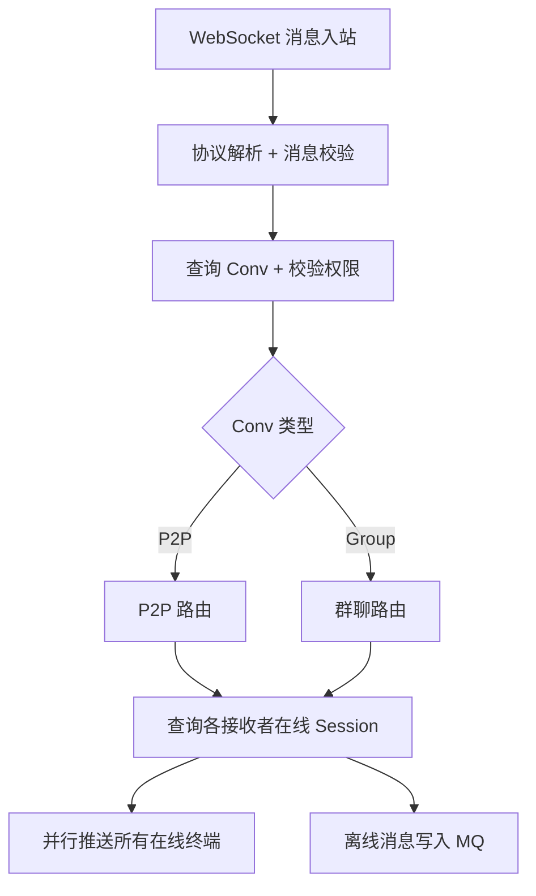
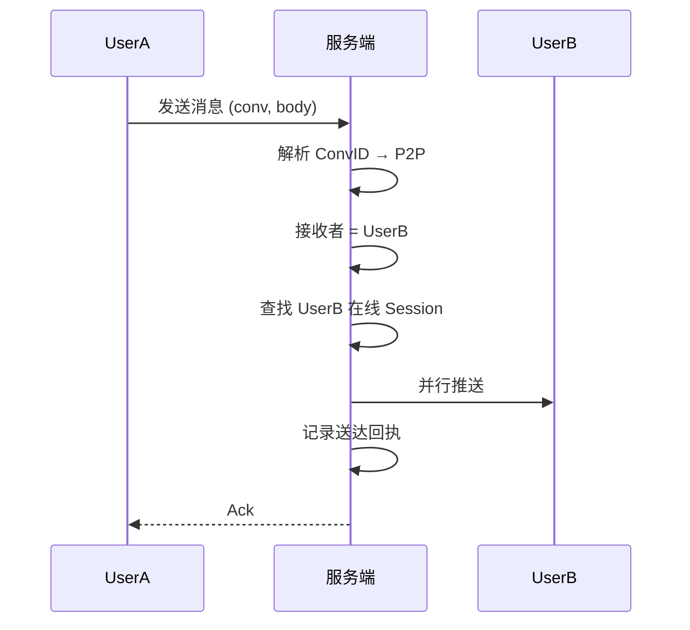
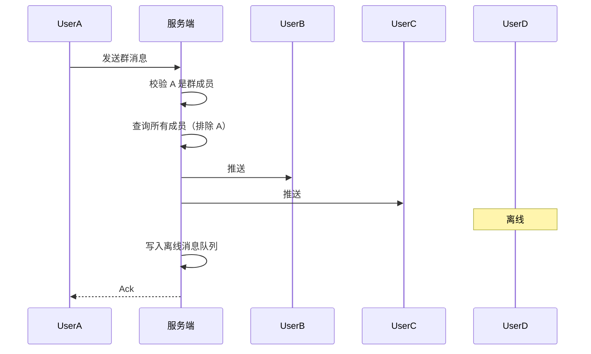
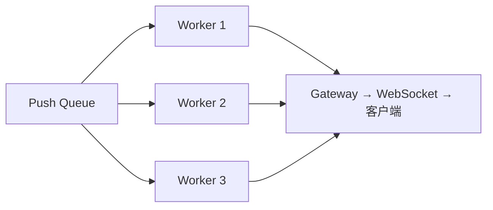

# 消息路由设计（P2P 与群聊）

## 1. 消息路由总流程



---

## 2. P2P 消息路由

### ConvID 说明

ConvID 不编码类型信息（无 `p2p:` 前缀）。服务端收到消息时通过 ConvID 查 conversations 表获取会话类型（P2P/Group）。

### 路由流程



### P2P 会话隐式创建

UserA 第一次给 UserB 发消息：
1. 检查 ConvID 是否存在
2. 不存在 → 创建会话 + 添加双方成员
3. 写入消息
4. 按常规路由推送

---

## 3. 群聊消息路由

### 群聊数据结构

| 字段 | 类型 | 说明 |
|------|------|------|
| ConvID | string | 会话 ID |
| Name | string | 群名称 |
| OwnerID | string | 群主 |
| MemberCount | int | 成员数量 |
| MaxMembers | int | 人数上限 |
| JoinPermission | enum | 自由 / 审核 / 禁止 |

### 群成员

| 字段 | 类型 | 说明 |
|------|------|------|
| UserID | string | 用户 ID |
| Role | enum | Member / Admin / Owner |
| Nickname | string | 群内昵称 |
| Mute | bool | 是否禁言 |
| JoinedAt | int64 | 加入时间 |

### 路由流程



### 写扩散 vs 读扩散

| 特性 | 写扩散 | 读扩散 |
|------|--------|--------|
| 写入方式 | 每人一条 | 只写一条 |
| 读取方式 | 读收件箱 | 读群消息 + 过滤 |
| 适用规模 | ≤500 人 | >500 人 |
| 写入开销 | O(N) | O(1) |
| 读取开销 | O(1) | O(logN) |

推荐策略：混合模式。小群写扩散，大群读扩散。

> **Phase 1 实现：统一使用读扩散。** 所有消息写入 `messages` 表（按 conv_id 存储），各终端通过 conv_seq 增量同步。写扩散作为 Phase 2 优化项，在群人数超过阈值时切换。

### 群聊功能

```mermaid
flowchart LR
    A[加群] --> B[搜索群 → 申请 → 审核/直接加入]
    C[退群] --> D[移除成员 → 系统消息通知]
    E[踢人] --> F[仅管理员 → 强制移除 → 系统通知]
    G[@提及] --> H[@某人 / @all → 特殊通知]
```

### 系统消息类型

| 类型 | 说明 |
|------|------|
| 成员加入 | 新人入群通知 |
| 成员退出 | 主动退群通知 |
| 成员被踢 | 管理员踢人通知 |
| 群创建 | 群创建成功通知 |
| 群名变更 | 群名称修改通知 |
| 管理员变更 | 添加/移除管理员通知 |

系统消息与普通消息共用同一 channel，`ContentType = System`，客户端做特殊渲染。

---

## 4. 消息推送实现



- 每个推送任务包含 `(SessionID, Message)`
- 多个 Worker 并发消费
- Worker 通过 SessionID 查找对应 WebSocket 连接并写入
