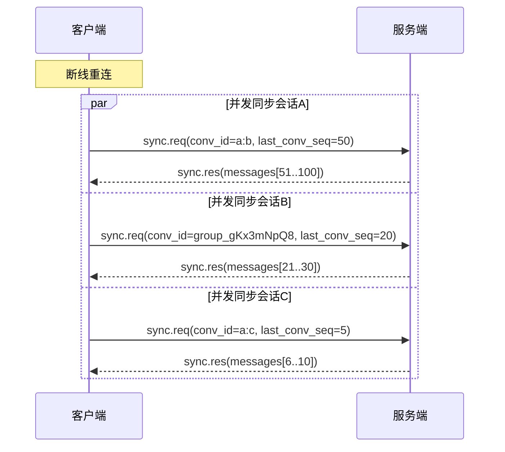

# WebSocket 消息协议

## 协议边界

| 协议 | 职责 | 典型场景 |
|------|------|---------|
| **WebSocket** | 需要实时处理的即时消息 | 收发消息、消息推送、增量同步、上线通知、正在输入、心跳 |
| **HTTP REST** | 非即时性的数据操作 | 用户信息、会话列表、消息历史、群管理、文件上传、上报已读 |

> HTTP API 详情见 `09-http-api.md`

---

## 1. 传输层

### 连接地址

```
ws://host:port/ws?token={jwt_token}
wss://host:port/ws?token={jwt_token}
```

### 连接生命周期

1. TCP 连接建立
2. HTTP Upgrade → WebSocket
3. Token 鉴权
4. 绑定 Session → ConnID
5. 开始消息收发
6. Ping/Pong 心跳（30s 间隔）
7. 断开连接 → 清理 Session

---

## 2. 通用消息帧

所有消息使用统一的 JSON 帧结构：

```json
{
  "type": 1,
  "id": "req_1680000001",
  "payload": {}
}
```

| 字段 | 类型 | 说明 |
|------|------|------|
| `type` | int | 消息类型，数字枚举 |
| `id` | string | 请求唯一标识，客户端生成，服务端响应时复用 |
| `payload` | object | 消息体，不同 type 结构不同 |

---

## 3. 消息类型枚举

| type | 名称 | 方向 | 说明 |
|------|------|------|------|
| 1 | MsgSend | C→S | 发送消息 |
| 2 | MsgSendAck | S→C | 发送确认 |
| 11 | MsgPush | S→C | 服务端推送消息 |
| 12 | MsgReceived | C→S | 确认收到推送 |
| 21 | SyncReq | C→S | 请求增量同步 |
| 22 | SyncRes | S→C | 同步响应 |
| 32 | MsgReadNotify | S→C | 已读通知转发 |
| 41 | SessionOnline | S→C | 用户上线 |
| 42 | SessionOffline | S→C | 用户下线 |
| 43 | SessionRecover | C→S | 断线重连恢复 Session |
| 44 | SessionRecoverAck | S→C | 恢复确认 |
| 51 | Typing | C↔S | 正在输入 |
| 61 | Ping | C→S | 心跳请求 |
| 62 | Pong | S→C | 心跳响应 |
| 71 | Error | S→C | 错误信息 |

### 枚举值分组

| 范围 | 分组 | 说明 |
|------|------|------|
| 1-9 | 消息发送 | 客户端发消息相关 |
| 10-19 | 消息推送 | 服务端推送相关 |
| 20-29 | 消息同步 | 增量同步相关 |
| 30-39 | 已读回执 | 仅服务端推送，上报走 HTTP |
| 40-49 | 会话事件 | 用户上线/下线/Session 恢复 |
| 50-59 | 输入状态 | 正在输入 |
| 60-69 | 心跳 | 连接保活 |
| 70-79 | 系统 | 错误、通知 |

---

## 4. 消息详情

### 4.1 消息发送

**发送消息** C → S (type=1)

```json
{
  "type": 1,
  "id": "req_1680000001",
  "payload": {
    "conv_id": "user_a:user_b",
    "content_type": 0,
    "body": "你好！",
    "reply_to": 0,
    "client_seq": 42,
    "mention": []
  }
}
```

**发送确认** S → C (type=2)

```json
{
  "type": 2,
  "id": "req_1680000001",
  "payload": {
    "msg_id": 2024000001,
    "timestamp": 1700000000000,
    "client_seq": 42,
    "status": 1
  }
}
```

status: 1=sent, 2=delivered, 3=read

### 4.2 消息推送

**服务端推送消息** S → C (type=11)

```json
{
  "type": 11,
  "id": "",
  "payload": {
    "msg_id": 2024000001,
    "conv_id": "user_a:user_b",
    "sender_id": "user_a",
    "content_type": 0,
    "body": "你好！",
    "reply_to": 0,
    "mention": [],
    "timestamp": 1700000000000,
    "conv_seq": 201
  }
}
```

**客户端确认收到** C → S (type=12)

```json
{
  "type": 12,
  "id": "req_1680000004",
  "payload": {
    "msg_id": 2024000001,
    "conv_id": "user_a:user_b",
    "conv_seq": 201
  }
}
```

服务端收到 ack 后，推进该 Session 在该会话的 user_seq。

### 4.3 消息同步

按会话维度同步。断线重连时客户端对所有已知会话并发发起 sync.req。

**拉取某个会话的消息** C → S (type=21)

```json
{
  "type": 21,
  "id": "req_1680000002",
  "payload": {
    "conv_id": "user_a:user_b",
    "last_conv_seq": 150,
    "limit": 50
  }
}
```

**同步响应** S → C (type=22)

```json
{
  "type": 22,
  "id": "req_1680000002",
  "payload": {
    "conv_id": "user_a:user_b",
    "messages": [
      {
        "msg_id": 2024000101,
        "sender_id": "user_b",
        "content_type": 0,
        "body": "在吗？",
        "timestamp": 1700000000100,
        "conv_seq": 151
      }
    ],
    "has_more": false
  }
}
```

客户端收到 sync.res 后，该会话的 user_seq 推进到返回的最大 conv_seq。如果客户端未收到响应（超时），直接重发 sync.req 即可（接口幂等）。

### 断线重连同步流程



### 4.4 已读通知

**已读通知转发** S → C (type=32)

```json
{
  "type": 32,
  "id": "",
  "payload": {
    "conv_id": "user_a:user_b",
    "user_id": "user_a",
    "session_id": "sess_xxxx",
    "msg_id": 2024000010,
    "timestamp": 1700000000200
  }
}
```

### 4.5 会话事件

**用户上线通知** S → C (type=41)

```json
{
  "type": 41,
  "id": "",
  "payload": {
    "user_id": "user_b",
    "session_id": "sess_yyyy",
    "device": 1,
    "device_name": "MacBook Pro"
  }
}
```

device: 0=Phone, 1=Desktop, 2=Web, 3=AgentInstance

**用户下线通知** S → C (type=42)

```json
{
  "type": 42,
  "id": "",
  "payload": {
    "user_id": "user_b",
    "session_id": "sess_yyyy"
  }
}
```

### 4.6 断线重连恢复

**客户端请求恢复 Session** C → S (type=43)

```json
{
  "type": 43,
  "id": "req_1680010",
  "payload": {
    "session_id": "sess_xxxx"
  }
}
```

WebSocket 连接建立后（token 已验证），客户端立即发送此消息将新连接绑定到指定 Session。服务端将新 ConnID 更新到该 Session。

**服务端恢复确认** S → C (type=44)

```json
{
  "type": 44,
  "id": "req_1680010",
  "payload": {
    "session_id": "sess_xxxx",
    "user_id": "user_a",
    "timestamp": 1700000000000
  }
}
```

恢复成功后，客户端开始对所有已知会话发起 sync.req。

> 如果 session_id 不存在或已过期，服务端返回 Error (type=71, code=4004)。客户端需重新登录。

### 4.7 正在输入

C → S / S → C (type=51)

```json
{
  "type": 51,
  "id": "",
  "payload": {
    "conv_id": "user_a:user_b",
    "user_id": "user_a",
    "session_id": "sess_xxxx"
  }
}
```

> 客户端在用户输入时持续发送（建议间隔 ≤3s），服务端 10s 内未收到新 Typing 消息则自动清除输入状态。无 "停止输入" 消息，靠超时判定。

### 4.8 心跳

C → S (type=61)

```json
{
  "type": 61,
  "id": "",
  "payload": {}
}
```

S → C (type=62)

```json
{
  "type": 62,
  "id": "",
  "payload": {}
}
```

---

## 5. 错误响应

S → C (type=71)

```json
{
  "type": 71,
  "id": "req_1680000001",
  "payload": {
    "code": 4001,
    "message": "消息内容不能为空"
  }
}
```

### 错误码

| code | 说明 |
|------|------|
| 4001 | 消息内容非法 |
| 4002 | 会话不存在或无权限 |
| 4003 | 消息频率超限 |
| 4004 | 发送者不在会话中 |
| 4005 | 消息体过大 |
| 5001 | 服务端内部错误 |

---

## 6. 公共字段枚举

### ContentType

| value | 说明 | 阶段 |
|-------|------|------|
| 0 | Text 文本 | Phase 1 |
| 5 | System 系统消息 | Phase 1 |
| 1 | Image 图片 | Phase 2 |
| 2 | File 文件 | Phase 2 |
| 3 | Audio 语音 | Phase 2 |
| 4 | Video 视频 | Phase 2 |
| 6 | MsgRecall 撤回消息 | Phase 2 |
| 7 | MsgEdit 编辑消息 | Phase 2 |
| 8 | Custom 自定义消息 | Phase 2 |

### DeviceType

| value | 说明 |
|-------|------|
| 0 | Phone |
| 1 | Desktop |
| 2 | Web |
| 3 | AgentInstance |
