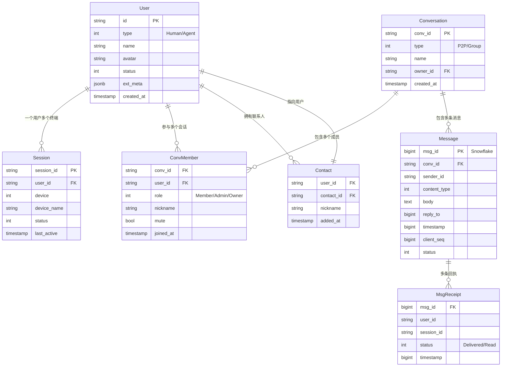

# 存储设计

## 1. 整体存储策略

| 存储内容 | 存储引擎 | 理由 |
|---------|---------|------|
| 用户数据 | PostgreSQL | 关系型，强一致 |
| 会话关系 | PostgreSQL | 关系型，事务支持 |
| 消息数据 | PostgreSQL | 关系型，支持复杂查询 |
| 消息 ID 生成 | Snowflake + Redis | 分布式 ID，高性能 |
| 在线状态 | Redis | 高频读写，需 TTL |
| Session 信息 | Redis + 内存 | 低延迟路由 |
| 离线消息 | Redis Stream | 轻量消息队列 |
| 文件/图片 | 对象存储 (S3/MinIO) | 海量存储，CDN |
| 消息搜索 | Elasticsearch | 全文检索 |

---

## 2. 存储关系图

---

## 3. 表结构

### users（用户表）

| 列 | 类型 | 说明 |
|----|------|------|
| id | varchar(32) PK | 用户 ID |
| type | smallint | 0=Human, 1=Agent |
| name | varchar(128) | 名称 |
| avatar | varchar(256) | 头像 URL |
| status | smallint | 在线状态 |
| ext_meta | jsonb | 扩展属性 |
| password | varchar(512) | RSA 非对称加密存储（公钥加密，私钥解密） |
| created_at | timestamp | 创建时间 |

索引：type, name

### sessions（终端 Session 表）

| 列 | 类型 | 说明 |
|----|------|------|
| session_id | varchar(32) PK | Session ID |
| user_id | varchar(32) FK | 所属用户 |
| conn_id | varchar(64) | 当前 ConnID（运行时态，仅存 Redis） |
| device | smallint | 设备类型 |
| device_name | varchar(128) | 设备名称 |
| status | smallint | Active/Inactive/Expired |
| login_at | timestamp | 登录时间 |
| last_active | timestamp | 最后活跃 |
| metadata | jsonb | 设备信息 |
| expired_at | timestamp | 过期时间 |

索引：user_id, status, expired_at

### conversations（会话表）

| 列 | 类型 | 说明 |
|----|------|------|
| conv_id | varchar(32) PK | 会话 ID |
| type | smallint | 1=P2P, 2=Group |
| name | varchar(256) | 名称 |
| owner_id | varchar(32) FK | 创建者 |
| max_members | int | 人数上限 |
| last_msg_id | bigint | 最后消息 ID |
| last_msg_at | timestamp | 最后消息时间 |
| created_at | timestamp | 创建时间 |

索引：updated_at

### conv_members（会话成员表）

| 列 | 类型 | 说明 |
|----|------|------|
| conv_id | varchar(32) FK | 会话 ID |
| user_id | varchar(32) FK | 用户 ID |
| role | smallint | 0=Member, 1=Admin, 2=Owner |
| nickname | varchar(128) | 群内昵称 |
| mute | boolean | 免打扰 |
| joined_at | timestamp | 加入时间 |

联合主键：(conv_id, user_id)
索引：user_id

### messages（消息表）

| 列 | 类型 | 说明 |
|----|------|------|
| msg_id | bigint PK | Snowflake ID |
| conv_id | varchar(32) FK | 会话 ID |
| sender_id | varchar(32) | 发送者 |
| sender_session_id | varchar(32) | 发送者的 SessionID（服务端注入） |
| content_type | smallint | 消息类型 |
| body | text | 消息体 |
| mention | varchar(64)[] | @提及的用户 ID 列表 |
| reply_to | bigint | 回复目标 |
| timestamp | bigint | 时间戳 |
| client_seq | bigint | 客户端序列号 |
| status | smallint | 消息状态 |
| deleted | boolean | 是否删除 |

索引：
- (conv_id, timestamp DESC)
- (sender_id, session_id, client_seq) 唯一索引 — 客户端去重
- body gin 索引 — 全文搜索

### msg_receipts（消息回执表）

| 列 | 类型 | 说明 |
|----|------|------|
| msg_id | bigint FK | 消息 ID |
| user_id | varchar(32) | 用户 ID |
| session_id | varchar(32) | 终端 ID |
| status | smallint | 1=Delivered, 2=Read |
| timestamp | bigint | 回执时间 |

联合主键：(msg_id, session_id)
索引：(user_id, msg_id)

### contacts（联系人表）

| 列 | 类型 | 说明 |
|----|------|------|
| user_id | varchar(32) FK | 用户 |
| contact_id | varchar(32) FK | 联系人 |
| nickname | varchar(128) | 备注名 |
| added_at | timestamp | 添加时间 |

联合主键：(user_id, contact_id)

---

## 4. Redis 数据结构

### 在线 Session

| Key | 类型 | 说明 |
|-----|------|------|
| user:sessions:{user_id} | Set | 用户的 SessionID 集合 |
| session:{session_id} | Hash | Session 详情 |
| conn:session:{conn_id} | String | 连接 → Session 映射 |

### 消息序列号

| Key | 类型 | 说明 |
|-----|------|------|
| session:seq:{session_id} | String | 每个 Session 的 last_seq |
| user:seq:{user_id}:{conv_id} | String | 用户在会话中的 last_seq |

### 离线消息

| Key | 类型 | 说明 |
|-----|------|------|
| offline:{user_id} | Stream | 用户离线消息队列 |

### 热点缓存

| Key | 类型 | 说明 |
|-----|------|------|
| conv:recent:{conv_id} | Sorted Set | 最近 100 条消息 |

---

## 5. 数据量估算

| 维度 | 单条大小 | 100 万用户估算 |
|------|---------|---------------|
| 用户表 | ~500B | 500MB |
| Session 表 | ~300B | 1.5GB (5 sessions/人) |
| 消息表 | ~1KB | 每人日发 50 条 → 5TB/年 |
| Conv 表 | ~200B | 2GB (10 convs/人) |

### 分表策略

消息表超过 1 亿行时，按 `conv_id` 哈希分表（64 张）或按月分表。

---

## 6. 缓存策略

| 数据 | 缓存位置 | TTL | 失效策略 |
|------|---------|-----|---------|
| Session 在线列表 | Redis | 300s + 心跳续期 | 被动过期 |
| 用户信息 | Redis | 3600s | 主动更新 |
| 最近消息 | Redis | 1800s | 新消息写入更新 |
| 会话成员 | 本地内存 | 60s | 定时刷新 |
