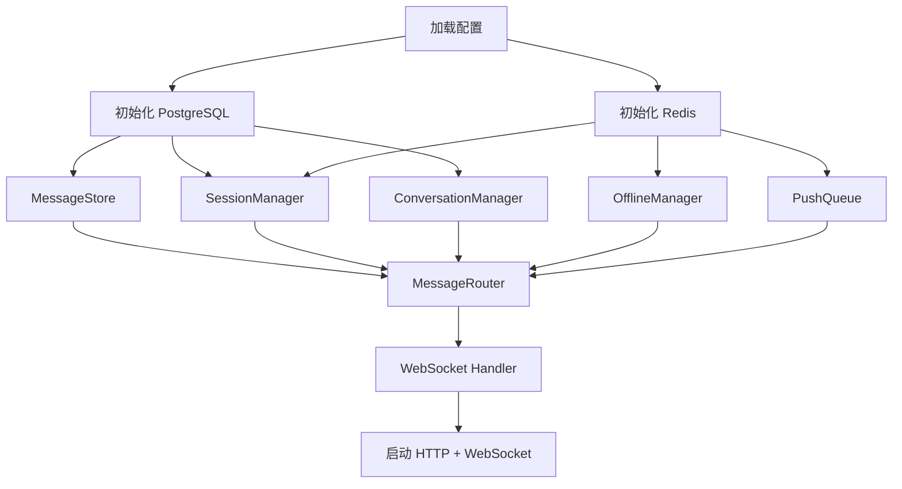

# 模块划分与实现建议

## 1. 服务端目录结构

```
server/
├── cmd/panda_ai/          # 服务入口
├── internal/
│   ├── gateway/            # WebSocket 连接管理
│   │   ├── conn.go         # 连接封装
│   │   ├── manager.go      # 连接管理器
│   │   └── heartbeat.go    # 心跳检测
│   ├── session/            # Session 管理
│   │   ├── manager.go      # CRUD
│   │   ├── registry.go     # 在线注册表
│   │   └── event.go        # 上线/下线事件
│   ├── auth/               # 认证
│   ├── message/            # 消息处理
│   │   ├── ingest.go       # 消息接收与校验
│   │   ├── router.go       # 消息路由
│   │   ├── store.go        # 消息持久化
│   │   ├── sync.go         # 增量同步
│   │   ├── receipt.go      # 回执
│   │   └── push.go         # 推送队列
│   ├── conversation/       # 会话管理
│   │   ├── p2p.go          # P2P 会话
│   │   ├── group.go        # 群聊
│   │   └── member.go       # 成员管理
│   ├── handler/            # WebSocket 消息处理器
│   ├── api/                # HTTP RESTful API
│   │   ├── router.go
│   │   ├── user.go
│   │   ├── conversation.go
│   │   ├── message.go
│   │   └── file.go
│   └── storage/            # 存储层
│       ├── db/             # PostgreSQL
│       ├── cache/          # Redis
│       ├── idgen/          # Snowflake
│       └── oss/            # 对象存储 (Phase 2)
├── pkg/
│   ├── model/              # 领域模型
│   ├── protocol/           # 协议编解码
│   └── logger/             # 日志
└── config/                 # 配置
```

---

## 2. 各模块职责

### 2.1 Gateway — 连接管理

| 组件 | 职责 |
|------|------|
| conn.go | WebSocket 连接封装，读写消息 |
| manager.go | 连接注册表，按 connID/userID 查找 |
| heartbeat.go | Ping/Pong 心跳检测，超时清理 |

### 2.2 Session — 终端管理

| 方法 | 说明 |
|------|------|
| Create | 创建 Session |
| Get | 查询 Session |
| GetUserSessions | 查询用户所有 Session |
| Delete | 删除 Session |
| BindConnection | 绑定 WebSocket 连接 |
| IsOnline | 判断用户是否在线 |

### 2.3 Message — 消息处理

| 组件 | 职责 |
|------|------|
| ingest.go | 消息接收、校验、限流 |
| router.go | 路由（P2P 找对方、群聊找所有成员） |
| store.go | 消息持久化 |
| sync.go | 增量同步逻辑 |
| receipt.go | 送达/已读回执 |
| push.go | 推送队列，并发 Worker 推送 |

### 2.4 Conversation — 会话管理

---

## 3. 初始化顺序



---

## 4. 客户端目录结构

### macOS / iOS

```
macOS/Shared/
├── IMApp.swift               # App 入口
├── Network/
│   ├── WebSocketClient.swift # WebSocket 连接
│   └── APIClient.swift       # HTTP 客户端
├── Models/                   # 数据模型
├── ViewModels/               # ViewModel
├── Views/                    # UI 层
│   ├── Login/
│   ├── Conversation/
│   ├── Chat/
│   └── Common/
└── Services/                 # 业务服务
```

iOS 与 macOS 共用 Network + Models + ViewModels，可抽取为共享 Swift Package。

### Android

```
android/app/src/main/kotlin/com/im/app/
├── network/     # OkHttp WebSocket + Retrofit
├── model/       # 数据模型
├── viewmodel/   # ViewModel + StateFlow
├── ui/          # Jetpack Compose UI
└── service/     # 业务服务
```

### Web

```
web/src/
├── api/         # WebSocket + HTTP 封装
├── models/      # 数据模型
├── store/       # Zustand 状态管理
├── pages/       # 页面组件
├── components/  # 通用组件
└── hooks/       # 自定义 Hooks
```

---

## 5. 分阶段实现计划

### Phase 1 — Server + macOS + iOS

| 步骤 | 内容 | 说明 |
|------|------|------|
| 1.1 | Server 基础框架 | Go 项目结构、配置、DB 初始化 |
| 1.2 | 数据模型 + 建表 | 所有表结构 |
| 1.3 | 用户认证 | 注册/登录/Token |
| 1.4 | Session 管理 | 多终端支持 |
| 1.5 | Gateway + WebSocket | 连接管理、消息帧 |
| 1.6 | P2P 消息 | 发送/接收/同步/多终端 |
| 1.7 | 群聊基础 | 创建群/成员管理/群消息 |
| 1.8 | macOS + iOS 客户端 | SwiftUI，共享 IMCore Package |
| 1.9 | 联调测试 | 多端端到端验证 |

### Phase 2 — Android + Web

| 步骤 | 内容 | 说明 |
|------|------|------|
| 2.1 | Android 客户端 | Kotlin + Jetpack Compose |
| 2.2 | Web 客户端 | React + TypeScript |
| 2.3 | 文件传输 | 上传/下载/预览 |
| 2.4 | 消息搜索 | Elasticsearch 全文搜索 |
| 2.5 | 全平台联调 | 四端互通测试 |
