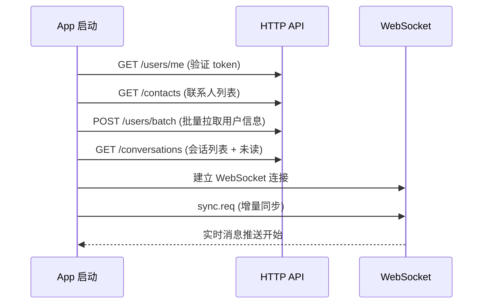
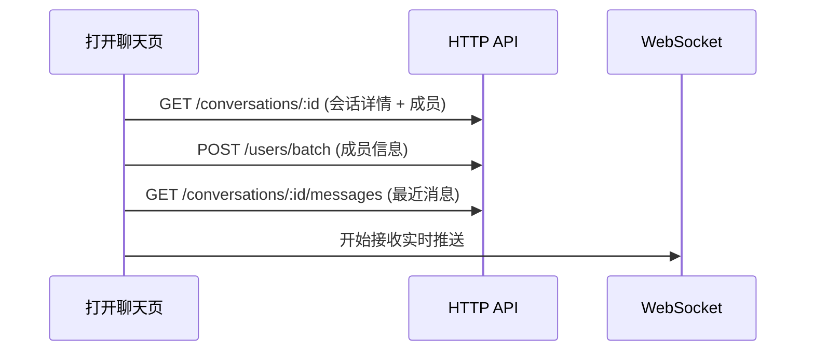

# 客户端架构设计

## 1. 跨平台策略

所有客户端通过 WebSocket + JSON 协议与 Server 通信，Server 不感知客户端平台差异。

### 代码复用程度

| 对比 | macOS ↔ iOS | Android | Web |
|------|-------------|---------|-----|
| 网络层 | 100% 复用 | 按协议重写 | 按协议重写 |
| 数据模型 | 100% 复用 | 按协议重写 | 按协议重写 |
| ViewModel | ~70% 复用 | 独立实现 | 独立实现 |
| UI 层 | ~30% 复用 | 独立实现 | 独立实现 |

### IMCore Package 物理形式

macOS 和 iOS 共用的网络层、Model、ViewModel 抽取为 **IMCore Swift Package**，放在同仓库目录下：

```
DolphinzZ/
├── server/           # Go 服务端
├── client/           # SwiftUI 客户端
│   ├── Packages/
│   │   └── IMCore/   # 共享 Package: Network + Models + ViewModels
│   ├── macOS/        # macOS App (依赖 IMCore)
│   │   └── IMApp.xcodeproj
│   └── iOS/          # iOS App (依赖 IMCore)
│       └── IMApp.xcodeproj
└── design/           # 设计文档
```

IMCore 通过 Xcode 的 **本地 Package 依赖** 引入，不涉及 submodule 或单独仓库。

---

## 2. 客户端架构分层

### macOS / iOS (SwiftUI)

```
View Layer         →  LoginView / ChatView / ConversationListView
ViewModel Layer    →  ChatViewModel / LoginViewModel / ConversationListViewModel
Service Layer      →  AuthService / MessageService / ConversationService
Network Layer      →  WebSocketClient / APIClient / Protocol Codec
Storage Layer      →  CoreData (本地缓存) / UserDefaults (偏好)
```

关键组件：

- **WebSocketClient**: 连接管理、心跳、自动重连、消息收发
- **Protocol**: 消息帧序列化/反序列化
- **ViewModel**: 状态管理（@Published/ObservableObject），业务逻辑编排
- **Service**: HTTP API 调用封装

### 平台差异处理

| 场景 | macOS | iOS (Phase 1) | iOS (Phase 2) |
|------|-------|---------------|---------------|
| 推送通知 | UserNotifications | WebSocket 在线时实时推送 | + APNs 离线推送 |
| 后台连接 | 常驻 | Background Task 保活 | + 推送唤醒 |
| 其他终端上线 | 右上角通知 | 前台时系统通知 | + APNs 转发 |

### Android (Kotlin + Jetpack Compose)

```
UI Layer            →  LoginScreen / ChatScreen / ConversationListScreen
ViewModel Layer     →  ChatViewModel / LoginViewModel (StateFlow + Coroutines)
Service Layer       →  MessageService / AuthService
Network Layer       →  OkHttp WebSocket / Retrofit HTTP / Protocol Codec
Storage Layer       →  Room (本地缓存) / DataStore (偏好)
```

### Web (React + TypeScript)

```
UI Layer            →  ChatPage / LoginPage / MessageBubble (React Components)
State Layer         →  authStore / chatStore / convStore (Zustand)
Hooks Layer         →  useWebSocket / useMessageSync
API Layer           →  WebSocket Client / axios HTTP / Protocol Codec
```

Web 特有考虑：
- 浏览器原生 WebSocket API
- BroadcastChannel API 实现 Tab 间同步
- PWA 可选

---

## 3. 客户端启动流程





---

## 4. 推送通道

| 平台 | 推送服务 | 说明 |
|------|---------|------|
| macOS | UserNotifications | 直接与 APNs 通信 |
| iOS | APNs（Phase 2） | 需 Server 转发 |
| Android | FCM（Phase 2） | 需 Server 转发 |
| Web | Service Worker Push | 需 HTTPS |
