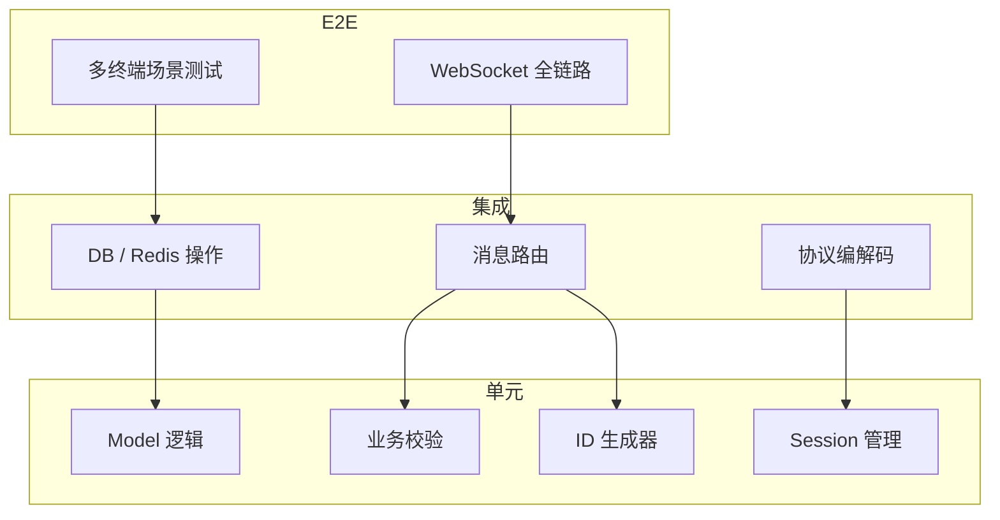
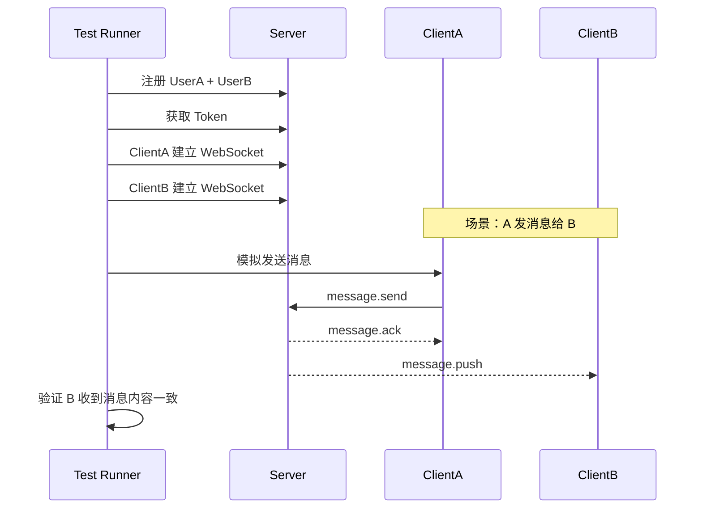
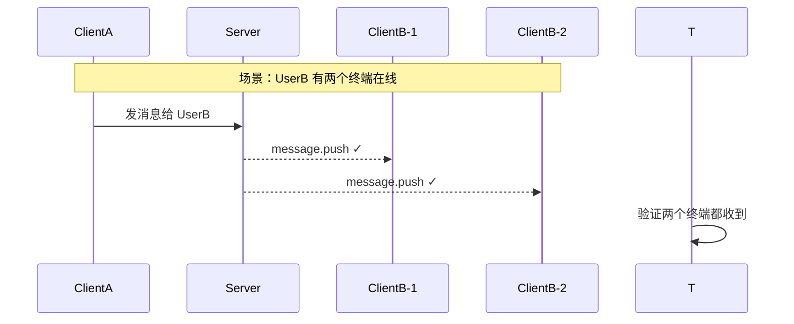
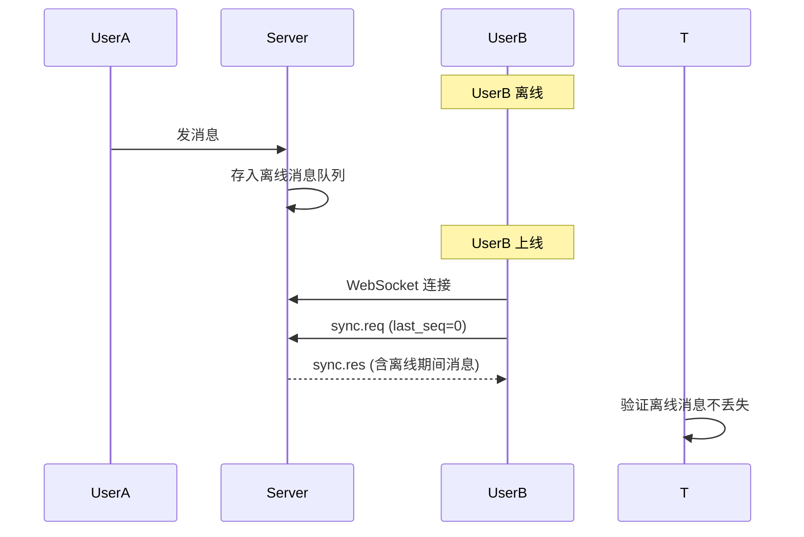

# 测试策略

## 1. 测试金字塔



| 层级 | 覆盖目标 | 占比 | 运行频率 |
|------|---------|------|---------|
| 单元测试 | 原子逻辑、边界条件 | 60% | 每次提交 |
| 集成测试 | 模块间交互、存储 | 30% | 每次提交 |
| E2E 测试 | 完整场景、多终端 | 10% | CI 每日 / 发版前 |

---

## 2. 单元测试

### Server 端 (Go)

| 模块 | 测试内容 | 关键场景 |
|------|---------|---------|
| Model 校验 | 消息体合法性、字段边界 | 空消息、超长消息、特殊字符 |
| ConvID 生成 | P2P ConvID 确定性 | userA+userB 与 userB+userA 结果一致 |
| Snowflake | ID 唯一性、单调递增 | 高并发下无重复、时间回拨处理 |
| 协议编解码 | JSON 序列化/反序列化 | 所有消息类型的正向 + 异常 case |
| Session 管理 | 增删改查、过期逻辑 | Session 不存在、重复创建 |
| 限流器 | 频率限制逻辑 | 阈值上下边界、窗口重置 |

### 客户端 (SwiftUI)

| 模块 | 测试内容 |
|------|---------|
| ViewModel | 消息发送/接收状态变更、未读数计算、已读逻辑 |
| 模型 | Message/User/Conversation 序列化 |
| 本地缓存 | CoreData 增删改查 |

---

## 3. 集成测试

### 测试环境

```
同一台机器：
  - Go test 启动真实 PostgreSQL（test 库）
  - Go test 启动真实 Redis（test 库）
  - 测试用 WebSocket Server（随机端口）
```

### 测试项

| 测试 | 方法 | 验证点 |
|------|------|--------|
| DB 读写 | 直接调用 store 层函数 | 消息写入/查询/分页正确 |
| Redis 缓存 | Session 注册表操作 | Set/Get/过期/TTL |
| 协议编解码 | 构造真实消息帧收发 | 各 type 的 encode/decode 一致 |
| HTTP API | httptest.Server | 注册/登录/会话/消息接口 |
| 消息路由 | mock 连接，验证推送目标 | P2P 只推对方、群聊排除自己 |
| 推送队列 | 模拟 Worker 消费 | 消息投递到正确 Session |

### 集成测试启动

```
go test -tags=integration ./internal/...  -- 需连接 PostgreSQL 和 Redis
go test -tags=unit ./internal/...         -- 纯单元测试，无外部依赖
```

---

## 4. WebSocket E2E 测试

这是 IM 系统最关键也最难测的部分。

### 测试工具

Phase 1 用 Go 原生 `net/http/httptest` + `gorilla/websocket` 客户端模拟多条连接，不上自动化测试框架。

### 核心场景

#### 4.1 基础消息收發



#### 4.2 多终端扇出



#### 4.3 离线消息



#### 4.4 增量同步

| 步骤 | 动作 | 验证点 |
|------|------|--------|
| 1 | ClientA 发送 10 条消息 | 全部成功 |
| 2 | ClientB 模拟离线，期间 ClientA 再发 5 条 | - |
| 3 | ClientB 重新连接，请求 sync | 收到 5 条增量消息 |
| 4 | ClientB 再次 sync | has_more=false，无重复 |

#### 4.5 心跳与断线重连

| 步骤 | 动作 | 验证点 |
|------|------|--------|
| 1 | Client 正常连接 | 收到 pong |
| 2 | 断开 TCP（服务端模拟） | 服务端标记 offline |
| 3 | Client 重新建立连接 | recover 成功后恢复 |
| 4 | Client 请求增量同步 | 断线期间消息不丢 |

#### 4.6 群聊场景

| 场景 | 验证点 |
|------|--------|
| A 发群消息 | B、C、D 都收到，A 不收到 |
| D 离线 | 离线消息队列正确存储 |
| D 上线 | 同步拉取到群消息 |
| @A | A 收到 mention=1 |
| A 退群 | A 不再收到该群消息 |

#### 4.7 多终端互踢/共存

| 场景 | 验证点 |
|------|--------|
| UserA 在两个终端登录 | 两个终端都收到 session.online |
| 其中一个断开 | 另一个收到 session.offline |
| 同一用户在两个终端发消息 | 两个终端的消息都在双方正确显示 |

---

## 5. 并发与压力测试

### 并发测试

| 场景 | 方法 | 预期 |
|------|------|------|
| 并发发消息 | 100 个 Client 同时发消息 | 消息不丢失、不重复 |
| 并发路由 | 1000 人群同时发消息 | 消息顺序正确 |
| 并发同步 | 50 个 Client 同时 sync | 不 panic、last_seq 正确 |
| 并发连接/断开 | 频繁 WebSocket 连/断 | 连接数正确、无泄漏 |

### 压力测试

| 指标 | 目标 | 说明 |
|------|------|------|
| 单机连接数 | 10000+ WebSocket | 1 台机器支撑 1 万并发连接 |
| 消息吞吐 | 5000 msg/s | 单进程每秒处理 5000 条消息 |
| 群聊扇出 | 500人群 × 10 msg/s | 5000 push/s 稳定 |
| 推送延迟 P99 | <500ms | 从发消息到接收端收到 |

### 压测工具

| 工具 | 用途 |
|------|------|
| Go 原生 benchmark | 单元/集成性能基线 |
| 自写压测脚本 | WebSocket 连接 + 消息收发（比通用工具更适配 IM 场景） |
| pprof | CPU/内存/goroutine 分析 |

---

## 6. 测试数据隔离

### 数据库策略

| 环境 | 数据库 | 数据来源 |
|------|--------|---------|
| 单元测试 | 无（mock） | 构造数据 |
| 集成测试 | `im_test` 独立库 | test setup 建表，teardown 清空 |
| E2E 测试 | `im_e2e` 独立库 | 测试框架初始化种子数据 |
| 压测 | 专用压测环境 | 不污染开发/测试库 |

### WebSocket 连接隔离

```
每次 E2E 测试用例：
  1. 启动 Server（随机端口，测试用 DB + Redis）
  2. 建立 N 个 WebSocket 连接
  3. 执行场景
  4. 断言
  5. 关闭 Server + 清理 DB
```

---

## 7. 客户端测试

| 平台 | 测试类型 | 内容 |
|------|---------|------|
| macOS/iOS | Unit Test (XCTest) | ViewModel 逻辑、Model 序列化、本地缓存 |
| macOS/iOS | UI Test (XCUITest) | 登录流程、会话列表渲染、消息发送 |

WebSocket 相关的客户端逻辑通过 mock server 测试：
- 本地启动一个 WebSocket Server 模拟服务端行为
- 测试重连、心跳超时、消息推送等场景

---

## 8. 测试清单

### Phase 1 必须覆盖

- [ ] 单元：Model 校验、ConvID 生成、协议编解码
- [ ] 集成：DB 读写、Redis Session 管理、HTTP API
- [ ] E2E：单终端 P2P 消息收发
- [ ] E2E：双终端消息扇出
- [ ] E2E：离线消息 + 增量同步
- [ ] E2E：心跳 + 断线重连
- [ ] E2E：基本群聊（创建/加人/发消息）

### Phase 2 补充

- [ ] 压测：10000 连接 + 5000 msg/s
- [ ] 并发：群聊扇出、多终端 race condition
- [ ] 客户端：ViewModel 单元测试 + UI 快照
